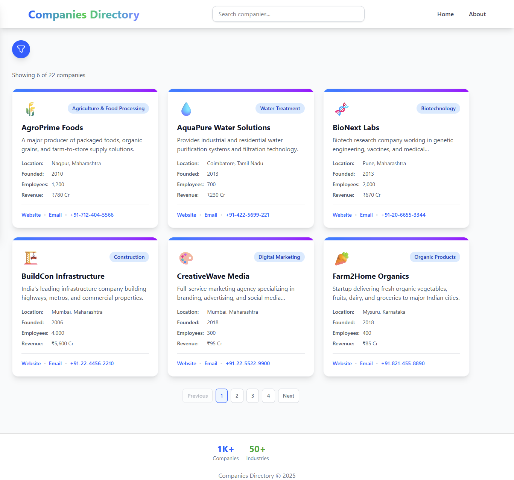

# Companies-Directory
The Companies Directory is a comprehensive platform designed to help users discover, explore, and connect with businesses across various industries.

## Features

- **Company Listings**: Beautiful card layout displaying company details
- **Advanced Filtering**: Filter by name, industry, and location
- **Search Functionality**: Real-time search across company names and descriptions
- **Sorting Options**: Sort by name, founding date, or employee count
- **Pagination**: Clean pagination for easy navigation
- **Responsive Design**: Mobile-first design that works on all devices
- **Loading States**: Smooth loading indicators
- **Error Handling**: Comprehensive error states

## Tech Stack

- **Frontend Framework**: React.js 18
- **Build Tool**: Vite
- **Styling**: Tailwind CSS
- **State Management**: React Hooks (useState, useEffect, useMemo)
- **Data**: Static JSON file (simulating API response)


## 🖼️ Preview



## Getting Started

### Prerequisites

- Node.js (version 14 or higher)
- npm or yarn

### Installation

1. Clone the repository or extract the project files
2. Navigate to the project directory:
   ```bash
   cd companies-directory

## Getting Started

### Prerequisites

- Node.js (version 14 or higher)
- npm or yarn

### Installation

1. Clone the repository or extract the project files
2. Navigate to the project directory:
   ```bash
   cd companies-directory

## Installation and Running Instructions

1. **Create the project directory** and add all the files as shown above
2. **Install dependencies**:
   ```bash
   npm install
Start the development server:

``` bash
npm run dev 
```
Open your browser and navigate to http://localhost:5173

